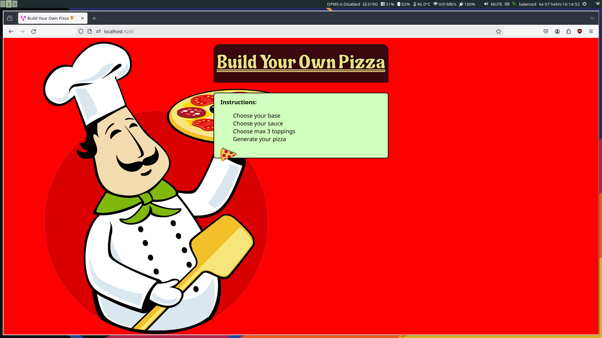

# BringYourOwnPizza

This is Angular program to build your own pizza.

Pizza can be built by choosing:

- One Base
- One Sauce
- Max three ingredients

After this you can print out your pizza in final screen.

Pizza picture is made out of layers of PNGs that form the pizza.




Implimented: (All implemented)
[x] You can choose one of the four bases
[x] You can choose one of the four sauces
[x] You can choose three ingredients
[x] You can print out your pizza (this and below is more or less same)
[x] Implement pizza print pictures (look at comment above)
[x] Finalize pizza printing (eg. make it fit and work properly)
[x] Refactor to more maintainable state (make adding ingredients, pictures etc easier)
[x] Clean up the visuals (Improve visuals and add some proper css)


## To run this program:

Git clone the repo:
`git clone https://github.com/oksuriini/byop.git`

Change directory:
`cd byop`

Install dependencies:
`npm install`

Run program with:
```ng serve```

Program is available from browser at "localhost:4200"
